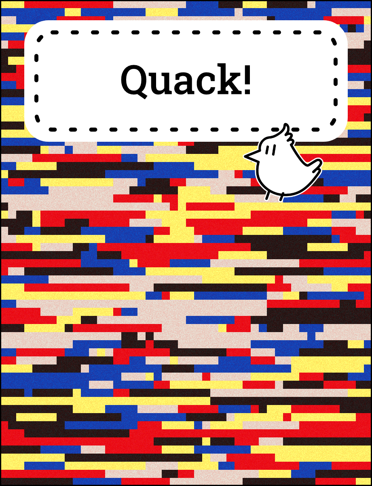

# The Story of Raphaël

### Added Diversifiers

-   [x] String -> Image (required)
-   [x] Cloud access

### Description

The background is a [Hiroshi Kawano](https://zkm.de/en/hiroshi-kawano-biography) inspired Mondrian. The mosaic is unique based on the current viewcount of sableRaph's twitch channel.

_But Rishi, how the heck is it "string to image?"_

Well, I'm so glad you asked that. It's because because Raph's viewership is a part of his story.
And this is a book about his story. I guess? I don't know man. I'm just making all this up. I'm late for the submission already.

During the [live stream](https://twitch.tv/sableraph) I asked Raph to change his twitch channel description. When he did that the title of the book cover changed from "Honk!" to "Quack!". Yes, you are correct. The description is used for the title.

Also I drew that patented sableRaph birb and I'm very proud of myself

This was a lazy submission, cheers everybody.
