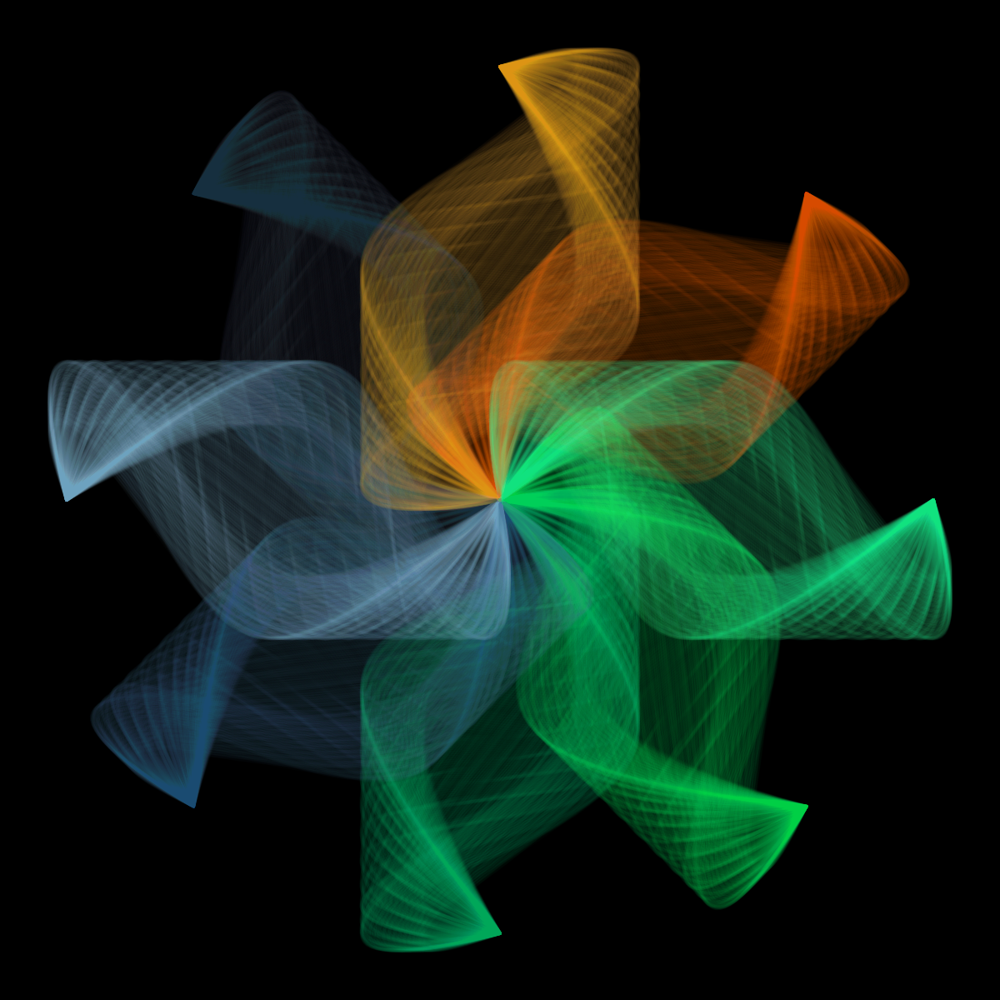
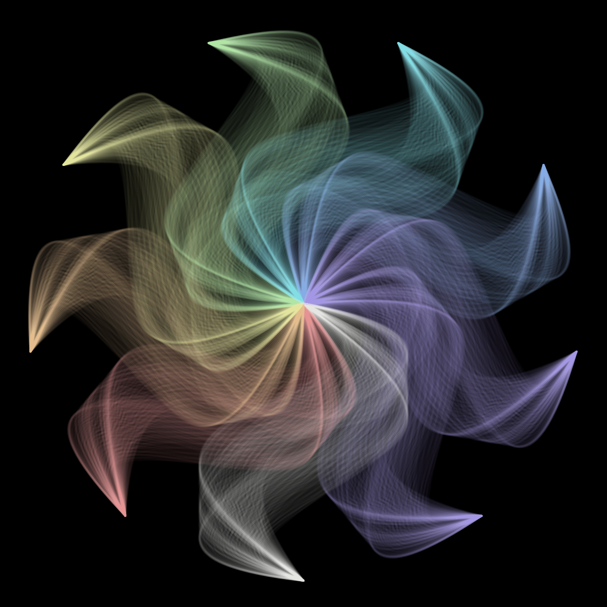
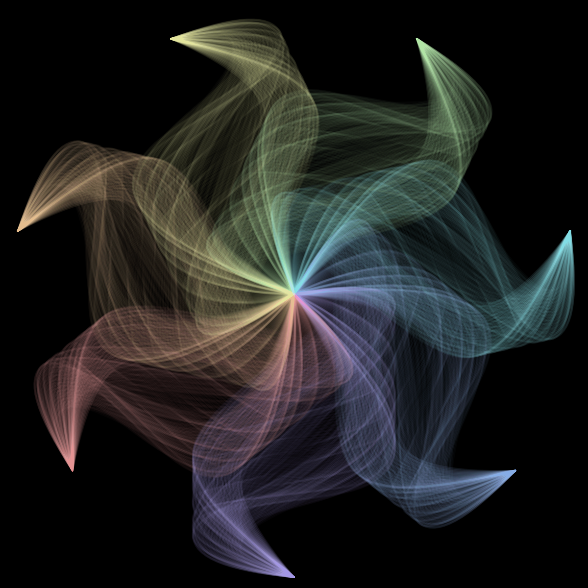
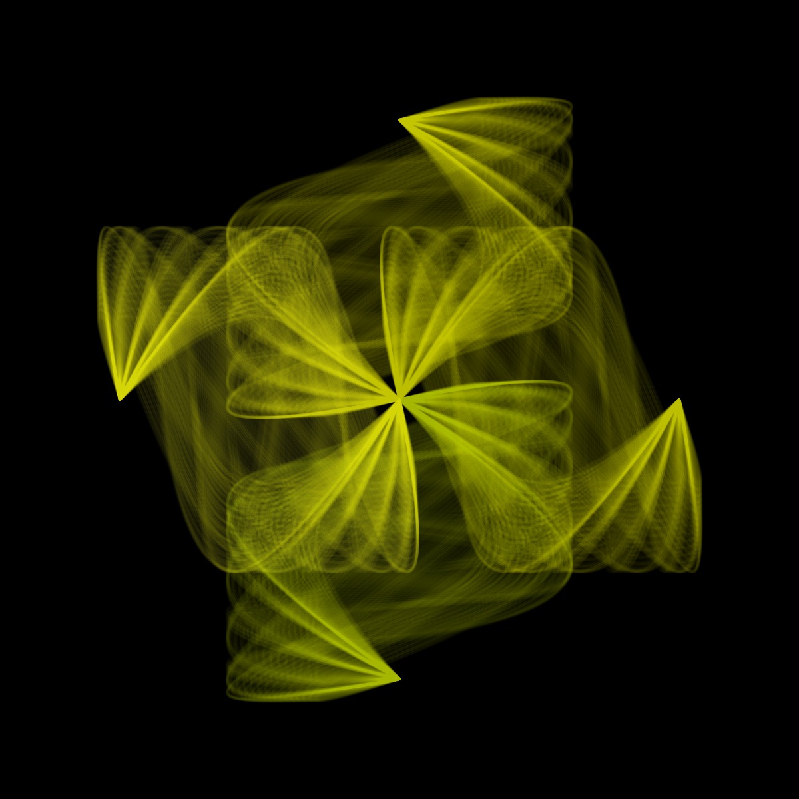
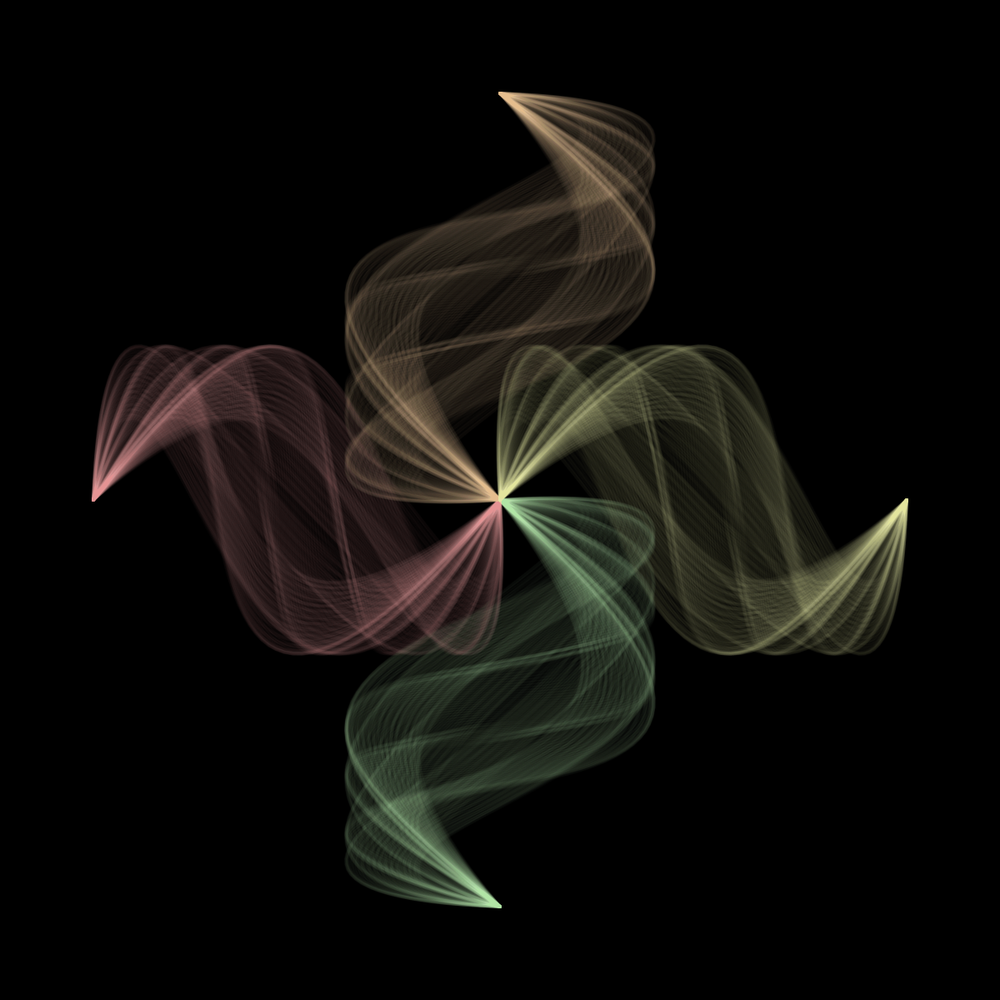
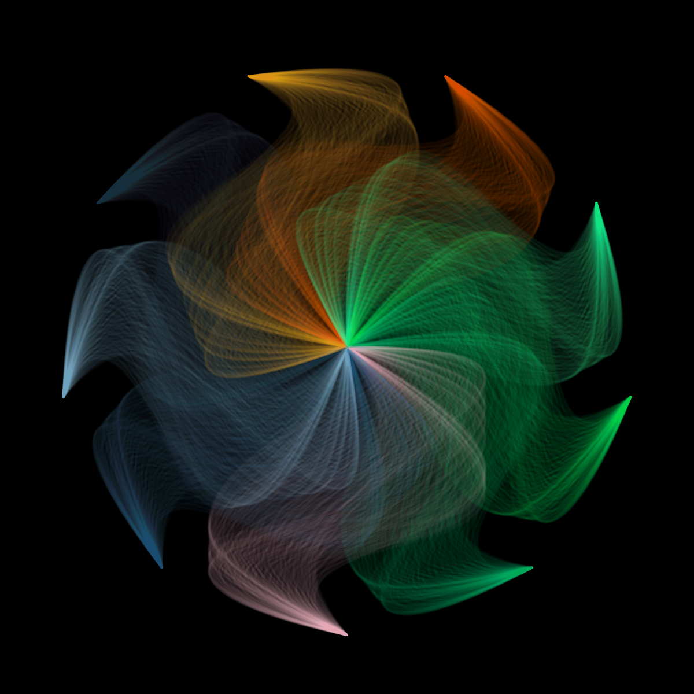
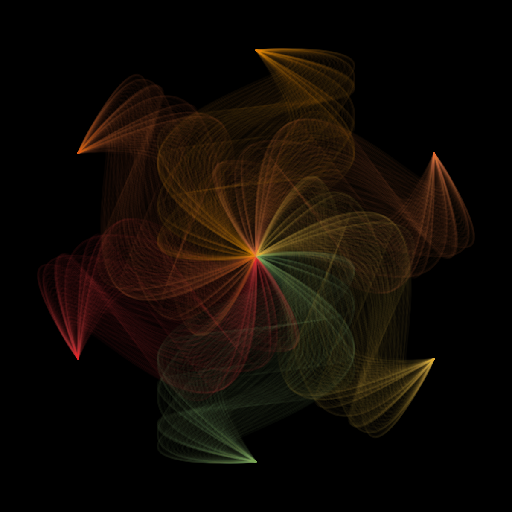

# Bézier Flower

Submission for the week: "Flower"  
Click [here](https://openprocessing.org/sketch/1319370) for the live sketch.

## Description

Basically cubic bézier curves with randomised sine movement fucntions.

### Screenshots

  
  
  
  
  
  
  
  
  
  
  
  
  
  

