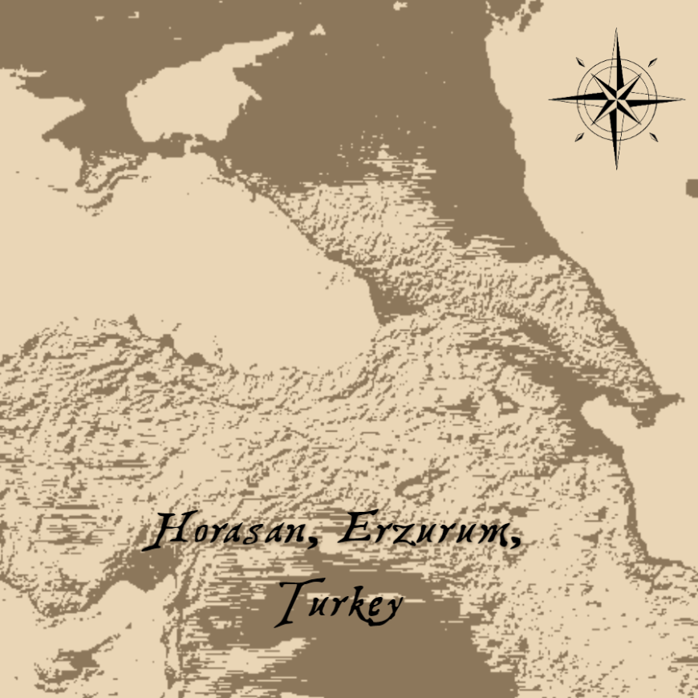
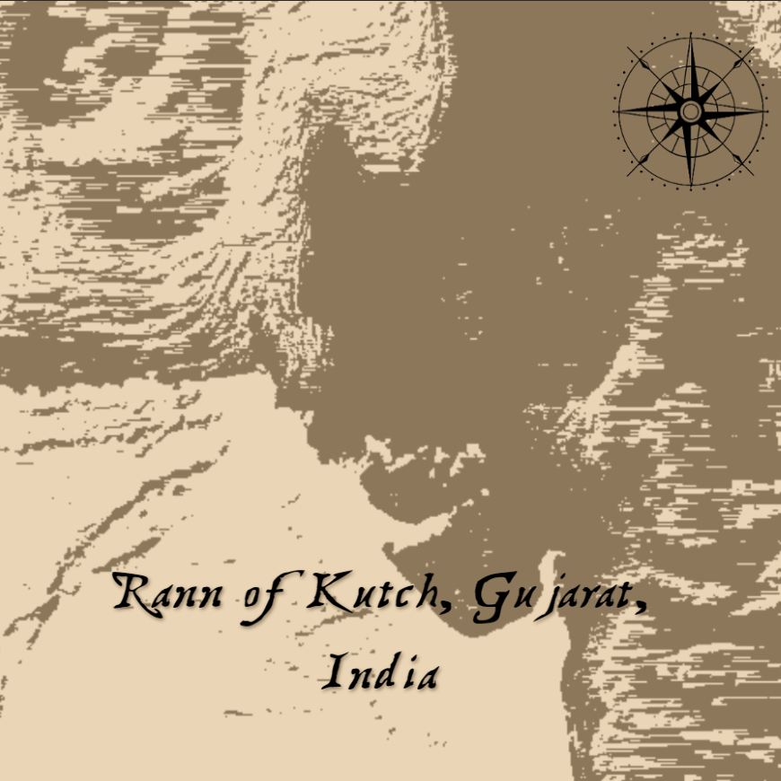
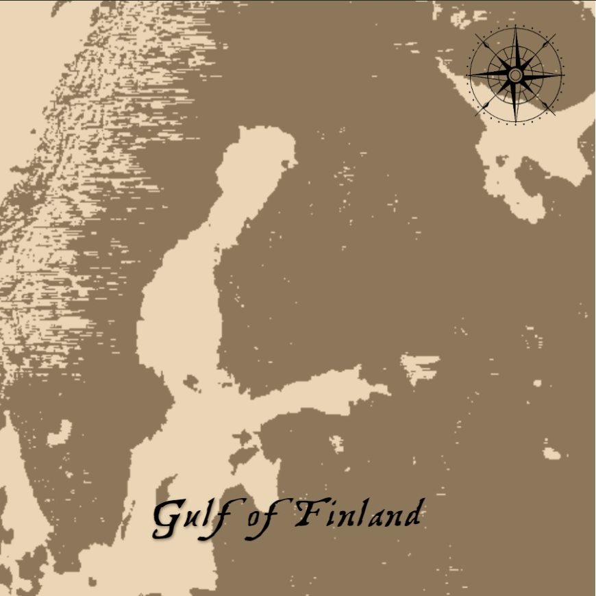

# Maps Maps Maps 🗺

A vintage map generator which generates maps by selecting a random location and doing some dithering. [Here's](https://ivan-denisovich-py.github.io/weekly-challenge/maps/) live preview.

## Quick Overview

Basically what it does:

-   Selects a random coordinate and fetches an almost square bounding box of that area from [GMRT](https://www.gmrt.org/services/index.php) Image Server. For now it selects the coordinates from an array of predetermined values, because most of the Earth is, you know, **water**.
-   A little bit of reverse geocoding to get the address of that area
-   Rest is just good old image processing (More about it [here](#process)) Looks... okay. I'm happy with it.

## Some Examples

    
    
    

## Process

So basically it's a type of dithering, as you probably have guessed. It's actually based on something called a _Random Dither_, which was theorized back in early 1950s. The idea is, it's ideally thresholding but the threshold value is randomly generated for each pixel. However, using random noise values would make very noisy image and it's a mess.

So I did what any Processing based developer would do, i.e, used Perlin Noise! Yaay! I'm sure people have done this before but, meh, it worked for me.

You can see the difference between a normal image, random dither and perlin noise dither in the following picture:

From Left to Right: Original Image, Random Dither, Perlin Noise Dither

## Acknowledgements

Originally made for [Raphaël's](https://twitter.com/sableRaph) weekly challenge "Maps". Thanks Raph for being motivating and gifting us a wonderful community.
