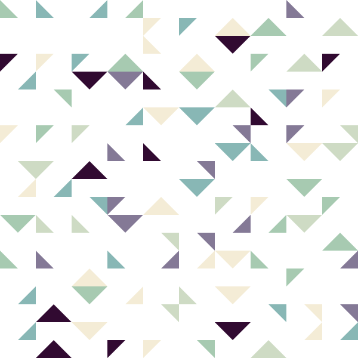

# Submission for Ana- err... Non-Computer

Here's my submission for this weeks very unambiguous topic: non-computer:

## Procedure

-   So it's kind of like 10 Print. There's a grid and a color palette. Each unit of the grid is divided into 6 segments like the following image. Each segment is assigned to a number, so are the six colors.

-   This is the grid in full glory:

-   Now the job is simple. You roll two dice, one tells you which segment to choose and one tells you which color to choose. If you forget which one is which, you can always toss a coin. Repeat it 100 times and you'll end up with something like the following image. The only job left is to erase all the grid lines.

## Honorable Mentions

I actually made a [processing version](processing_example/) which you can deconstruct if you wish. I doubt that you will, because I bet you are speedrunning write now. However, here's screenshot from it:

